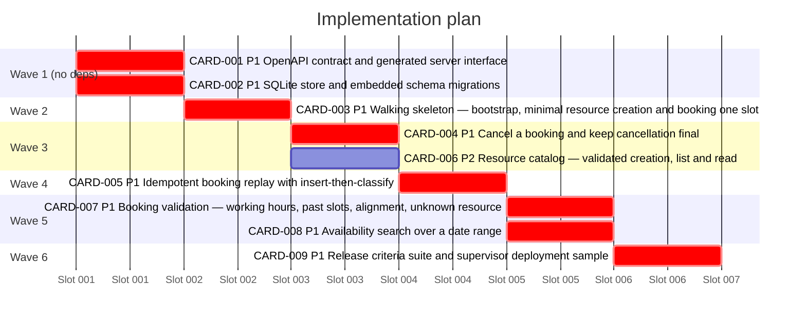

# Implementation plan

Generated by `/forge:kanban decompose` from `meta/architecture/handoff.md` (4 increments, 9 cards).

```mermaid
gantt
  title Implementation plan
  dateFormat X
  axisFormat Slot %j
  %% Gantt durations — 0 of 9 cards carry a days term, every bar is the nominal 1d bar, not an estimate
  section Wave 1 (no deps)
    CARD-001 P1 OpenAPI contract and generated server interface :crit, card1, 0, 1d
    CARD-002 P1 SQLite store and embedded schema migrations :crit, card2, 0, 1d
  section Wave 2
    CARD-003 P1 Walking skeleton — bootstrap, minimal resource creation and booking one slot :crit, card3, after card1 card2, 1d
  section Wave 3
    CARD-004 P1 Cancel a booking and keep cancellation final :crit, card4, after card3, 1d
    CARD-006 P2 Resource catalog — validated creation, list and read :card6, after card3, 1d
  section Wave 4
    CARD-005 P1 Idempotent booking replay with insert-then-classify :crit, card5, after card4, 1d
  section Wave 5
    CARD-007 P1 Booking validation — working hours, past slots, alignment, unknown resource :crit, card7, after card5 card6, 1d
    CARD-008 P1 Availability search over a date range :crit, card8, after card4 card5 card6, 1d
  section Wave 6
    CARD-009 P1 Release criteria suite and supervisor deployment sample :crit, card9, after card7 card8, 1d
```
